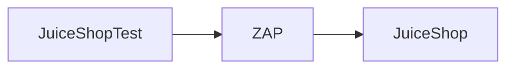

# ZAP test in Java

`JuiceShopTest` configures ZAP to run penetration tests against `OWASP JuiceShop` 



# How it works

- ZAP runs on `localhost:8080`
- OWASP JuiceShop runs on `localhost:3000`
- HTML report of the alerts is produced at `target/zap-reports/alerts.html`
- DOM XSS scan is disabled as it takes up too much memory resulting in an OOM due to multiple headless browsers

## Build and run the application

1. Start ZAP and OWASP JuiceShop

```
docker compose up
```

2. Run `JuiceShopTest` from IntelliJ
3. View the report at `target/zap-reports/alerts.html`